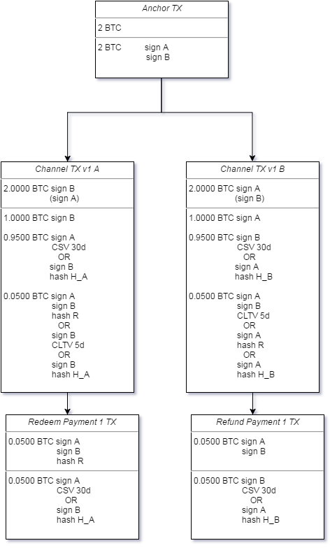

# thundernetwork

[](https://travis-ci.org/matsjj/thundernetwork)

Client/server implementation of the [lightning.network](http://lightning.network/) P2P protocol. The lightning.network enables Off-Chain Bitcoin Payment Channels using smart contracts.

This is software in alpha status, don't even think about using it in production with real bitcoin.

Donations: `13KBW65G6WZxSJZYrbQQRLC6LWE6hJ8mof`

## Feature List
- [X] Encryption
- [X] Authentication
- [X] Channel Opening Process
- [X] Payment Debate 
- [X] Relaying Payment
- [X] Settling Payment
- [X] Peer Seeding
- [X] Providing new Peers with Topology
- [X] Basic Gossip Protocol
- [X] Interface for Connecting into Wallet Software    
- [X] Basic Blockchain Watching Capability    
- [X] Closing a Channel    
- [ ] Hardening against various DDoS attacks   
- [ ] Backing Database Implementation (currently only in memory)    
- [ ] Restoring state after restart - cheking old TX for cheating
- [ ] Claiming funds after counterparty cheated


## Building

### Prerequisites

You need 
```
JDK 1.8+
Maven
```
to build both the node and the wallet software.

### Installation

Executing 
```
./build.sh
```
will run the tests and create the executables. 

### Running

Node software and Wallet software are completely independent projects. Nodes are generally passive participants of the network that only relay payments, whereas the Wallet software is only used to make and receive payments.

#### Node

Running
```
java -jar node.jar
```

#### Wallet

will start up an autonomous node that will connect to the thunder.network and build channels with other random nodes. On first startup it will ask the user for some basic configuration. Afterwards it will write this configuration to disk for the next start. To be an active part of the network, please configure your firewall to allow incoming connections on port 2204. You can change the default port in the config file.

Running
```
java -jar wallet.jar
```
will start up the wallet. It will ask for known nodes and get a topology of the network. The user can then chose a node to form a channel with and make and receive payments. 


## Architecture

thunder.network uses netty as the underlying networking library. There are several layers for encryption, establishing a channel and making payments. 

Additional features will generally live inside their own layer, decoupled from the other layers.

### Outlook

thunder.network uses a commitment-transaction design that needs both [CSV](https://github.com/bitcoin/bips/blob/master/bip-0112.mediawiki) and [Segregated Witness](https://github.com/bitcoin/bips/blob/master/bip-0141.mediawiki) to be completed. Otherwise the payments are not enforcable on the blockchain and are bad promises at best.


### Dual-TX Approach

thunder.network implements a commit-transaction design where each payment pays to a 2-of-2 multisig + R || TIMEOUT first. Both parties then create an additional revocable transaction paying to the correct receiver. While this adds additional complexity and makes on-chain resolvement more expensive, it allows for decoupling the revocation delay from the refund timespan, which otherwise would not be possible.

In the diagram below, A is receiving a payment from B. If he wants to accept the payment, he has to produce R within 5 days, otherwise the payment is not enforcable. Regardless of that, B can always claim even that payment for another 30d if A cheated and broadcasted a revoked transaction.



### Routing

Currently we are using a completely source-oriented onion-encrypted routing algorithm. This means that the receiver gives his public key and the sender creates the complete route to the receiver (_source-oriented_). To make this reliable, each `ChannelPubkeyObject` and other topology data has to be broadcast and gossiped through the network. This can be problematic in case of bad network conditions, where the `ChannelPubkeyObject` of a new node might now propagate to the sender. In this case the sender is not able to find a route and therefore the payment fails.

It is therefore an open TODO to allow for Rendezvous-Point routing (_RP_). In _RP_-Routing the sender will send the public key of a nearby node and the encrypted route from this node to himself. This will make addresses much longer (as they now contain an encrypted route), but will greatly improve privacy (the sender does not know the final receiver) and reliability of path finding (nodes have a much higher probability to be in the senders topology than the receiver's wallet).

Furthermore all routes are onion-encrypted, meaning that for each node in the route we will add one layer encrypting all subsequent layers. When decrypting, each node is only able to read the next node it should pass the payment to. Doing so makes disincentivizing wrong behaviour more difficult later on, but makes active analysis of payments less feasible.

### Anchor

The channel-establish process is due to a rework. It currently uses the anchor-escape-fastescape mechanism described in the deployable-lightning paper. However, it has some downsides and is not necessary anymore once SegWit is deployed.
Both parties will likely create the funding transaction together, sending a half-signed tx back and forth, with one party broadcasting it to the network. Because transaction malleability is non-existent, this party cannot hold the other parties funds hostage.

### Optimizations

As this is still a prototype, various optimizations are left open for now, as they would hinder active development. For example, JSON was chosen to serialize messages, as Gson allows for very prototype-friendly development, even though it increases message size 3-5 fold.


## Resources

- [1] LN-Implementation by Rusty Russel, https://github.com/ElementsProject/lightning
